# Architecture

The spine of this vault. All PRDs reference diagrams here by anchor (`[[architecture#5-auth-flows]]`). When the design changes, this file changes first; PRDs follow.

## Table of contents

1. [System context](#1-system-context)
2. [Control plane layers](#2-control-plane-layers)
3. [VpnEngine driver interface](#3-vpnengine-driver-interface)
4. [Data model](#4-data-model)
5. [Auth flows](#5-auth-flows)
6. [MikroTik provisioning](#6-mikrotik-provisioning)
7. [Quota enforcement loop](#7-quota-enforcement-loop)
8. [Multi-router federation](#8-multi-router-federation)
9. [Multi-path routing](#9-multi-path-routing)
10. [Phasing dependency graph](#10-phasing-dependency-graph)

---

## 1. System context

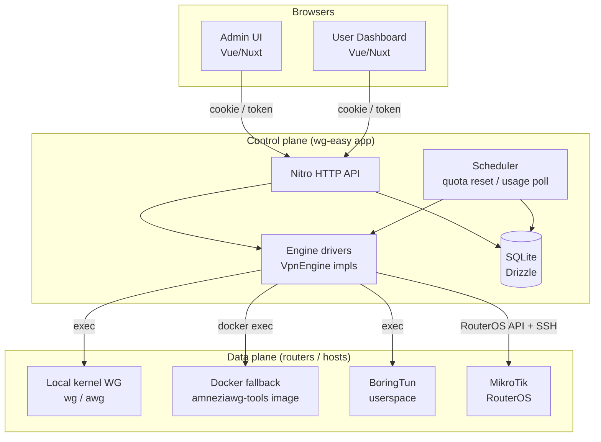

The **control plane** is one process. The **data plane** is one or more routers it manages. The local box is just `router_id = 0` — the same code path that drives a remote MikroTik drives the local kernel WireGuard.

For Linux engines (WG/AWG), the orchestrator employs an **availability-first strategy**:
1. Check for native kernel tools/modules.
2. Fall back to userspace implementation (`wireguard-go` / `amneziawg-go`) inside the control plane container.
3. For remote Linux hosts lacking binaries, fall back to a **Dockerized Engine** (running the tools via a transient `docker run` on the host).

PRDs that elaborate this view: [[prds/00-foundation/01-backend-abstraction]], [[prds/30-multi-engine/01-amneziawg-promotion]], [[prds/40-multi-server/01-multi-router-federation]].

---

## 2. Control plane layers

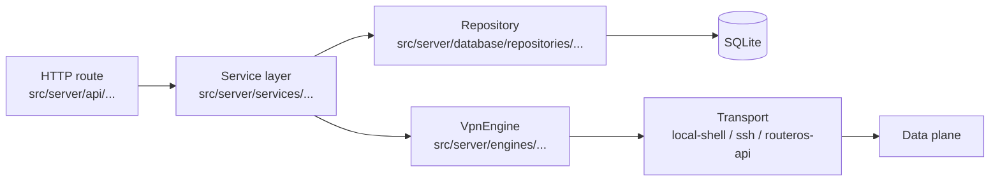

Today wg-easy mixes service logic into route handlers and into the `WireGuard` class. We introduce an explicit **service layer** to mediate between HTTP and (engine + repo) so the same operation (e.g., "create client") works identically whether triggered by the admin UI, the user dashboard, an API token, or the scheduler.

A **transport** is the thing that physically delivers a command. The current code has one transport: `child_process.exec` (`src/server/utils/cmd.ts`). We add `ssh` and `routeros-api` as siblings. Drivers compose transports — the MikroTik driver uses `routeros-api` for steady state and `ssh` for bootstrap.

---

## 3. Engine Discovery & Fallback

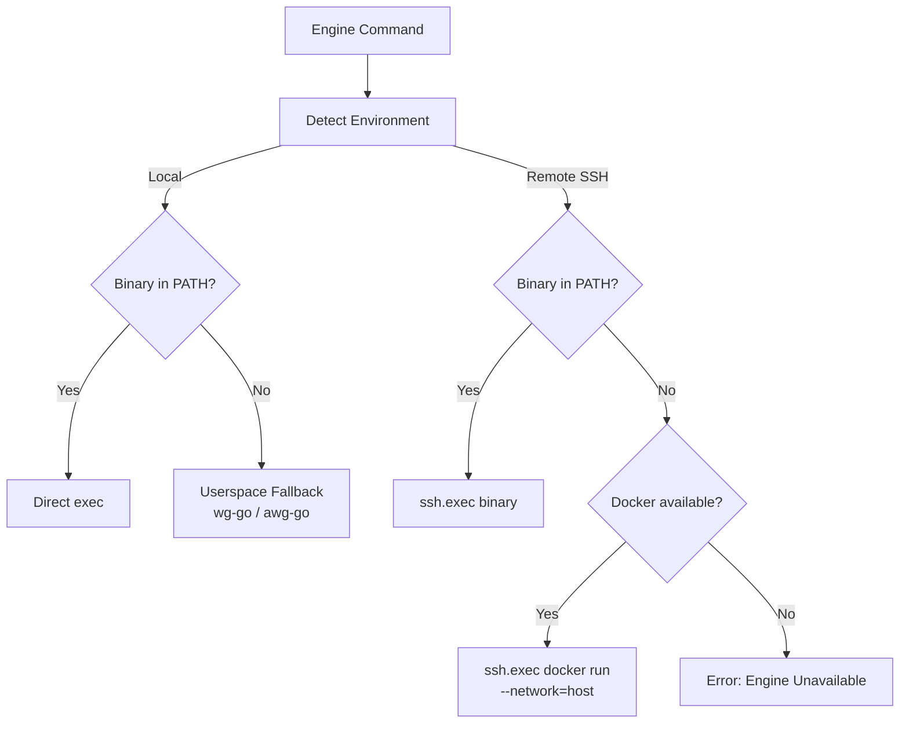

To support disparate host environments (e.g., Debian vs. Alpine) without manual tool installation, the `AmneziaWgEngine` and `WireguardEngine` can wrap their commands in a containerized environment if `docker` is detected on the target host.

---

## 4. VpnEngine driver interface

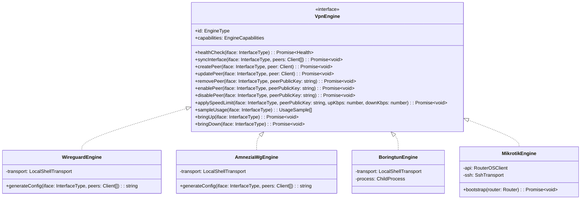

One interface, four implementations. The interface is **deliberately narrow**: every method maps to a single user-visible operation. Capability flags (`supportsObfuscation`, `supportsSpeedLimit`) let the UI gracefully degrade — e.g., the speed-limit input is disabled if the selected engine doesn't support it.

`sampleUsage()` returns per-peer rx/tx counters. The scheduler polls this on an interval (default 60s) and writes `usage_sample` rows; the quota engine reads those.

`bringUp` / `bringDown` exist because some engines (BoringTun, MikroTik) have a meaningful "interface state" that can't be re-derived from config alone.

PRD: [[prds/00-foundation/01-backend-abstraction]].

---

## 4. Data model

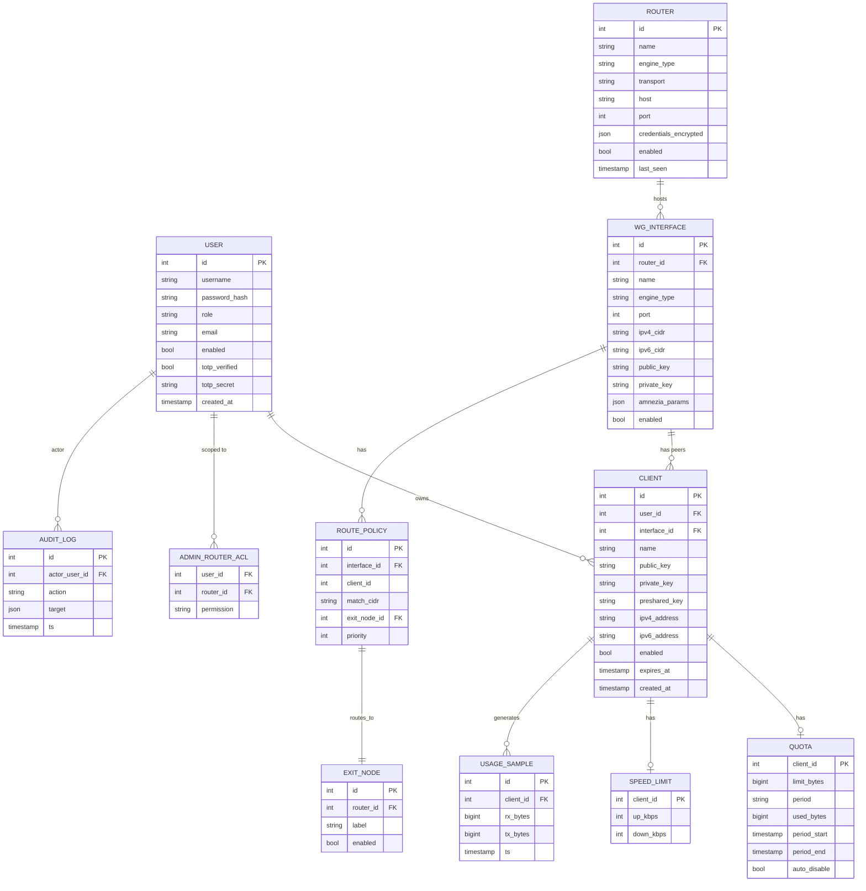

Two tables already exist (`user`, `wg_interface`, `client`); the rest are added in [[prds/00-foundation/04-data-model-migration]]. `engine_type` is denormalized from `router` to `wg_interface` for query efficiency.

`USAGE_SAMPLE` is the highest-volume table. It is partitioned by retention: keep raw 60s samples for 7 days, then roll up to hourly aggregates. The quota engine queries the rollup, not raw samples, except for "current period in progress."

`ROUTE_POLICY.client_id` is nullable: a policy may match on CIDR alone (subnet routing) or be scoped to a specific client.

---

## 5. Auth flows

### 5a. Admin login (existing, lightly extended)

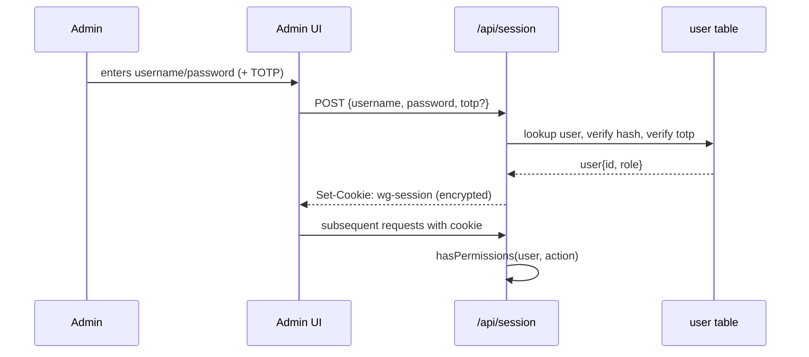

### 5b. User dashboard login (NEW — by QR or pubkey)

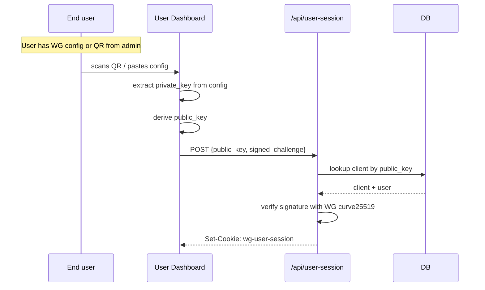

The user does **not** have a password. They prove ownership of their WireGuard private key by signing a server-issued challenge. The dashboard is read-only by default — view usage, expiry, status, download a fresh config — with no admin powers.

### 5c. Multi-admin RBAC check

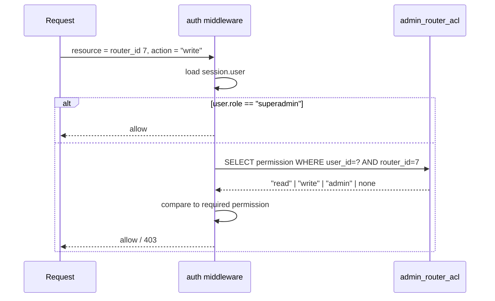

PRDs: [[prds/00-foundation/03-auth-refactor]], [[prds/00-foundation/02-multi-admin-rbac]], [[prds/20-user-features/02-qr-key-login]].

### 5d. Principal resolution (Nitro server middleware)

Principal resolution happens **once per request** in a Nitro server middleware (`src/server/middleware/principal.ts`), which runs before both API route handlers and SSR page rendering. The middleware calls `resolvePrincipal(event)` (a `server/utils` auto-import) and caches the result on `event.context.principal`. This keeps the `app/` layer (universal middleware, plugins, pages) from directly referencing server-only utilities, which would fail under SSR because Nuxt auto-imports `server/utils` only inside the `server/` directory tree. The global auth middleware (`src/app/middleware/auth.global.ts`) then reads `event.context.principal` on the server branch and falls back to `authStore.getSession()` on the client.

---

## 6. MikroTik provisioning

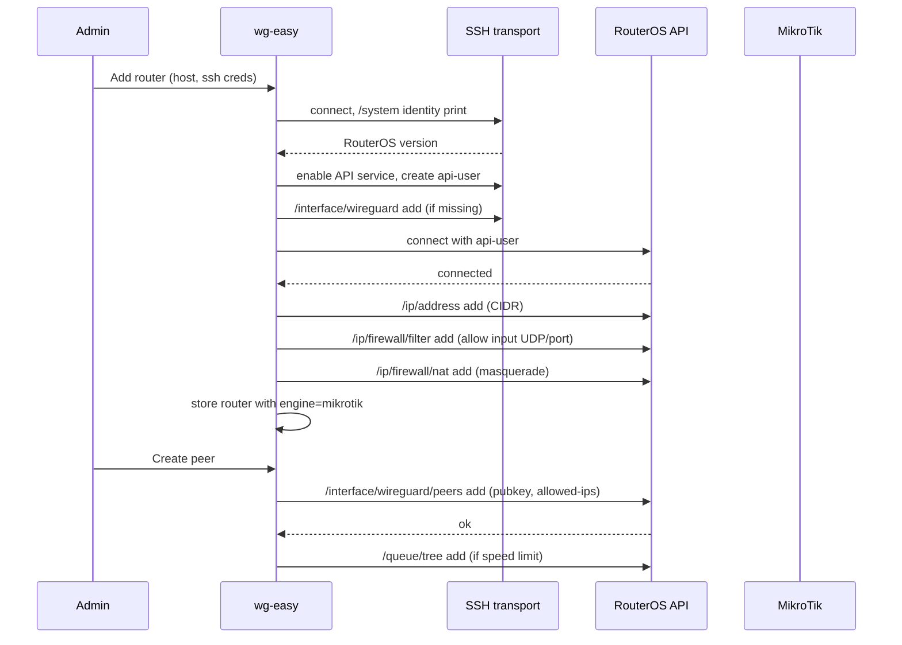

Two transports per MikroTik: **SSH for bootstrap** (creates the API user, enables the API service, sets up the WireGuard interface and firewall rules), **RouterOS API for steady state** (peer CRUD, queue tree updates, usage polling). After bootstrap, SSH is only re-used for upgrades and disaster recovery.

The `bootstrap` step is idempotent: re-running it on an already-configured router should produce no changes (modulo credential rotation).

PRDs: [[prds/10-mikrotik/01-mikrotik-driver]], [[prds/10-mikrotik/02-mikrotik-autoconfig]].

---

## 7. Quota enforcement loop

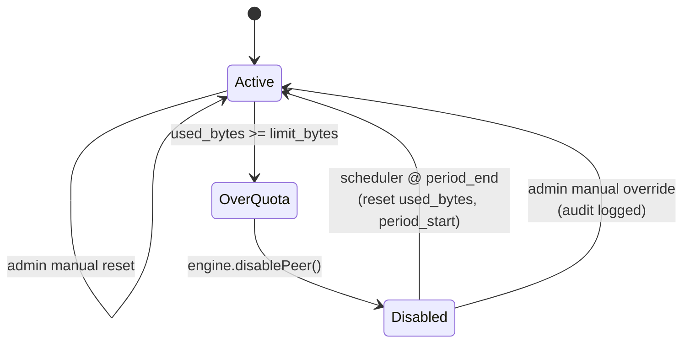

**Sample → Accumulate → Compare → Act → Reset.**

- Scheduler ticks every N seconds (default 60). For each enabled interface, it calls `engine.sampleUsage()`, diffs against the previous sample, writes to `usage_sample`, increments `quota.used_bytes`.
- When `used_bytes >= limit_bytes`, the scheduler calls `engine.disablePeer()` and writes an audit log entry.
- A second scheduler (cron-like) runs at midnight UTC for daily, Monday 00:00 for weekly, 1st of month 00:00 for monthly. It resets `used_bytes`, advances `period_start`/`period_end`, and re-enables peers that were *only* disabled by quota (not manually disabled).

Edge case: if the user is disabled by both quota AND manual admin action, period reset re-enables only if the manual disable was lifted. Track this via `audit_log` reasons rather than a separate `disable_reason` column.

PRD: [[prds/20-user-features/03-bandwidth-quotas]].

---

## 8. Multi-router federation

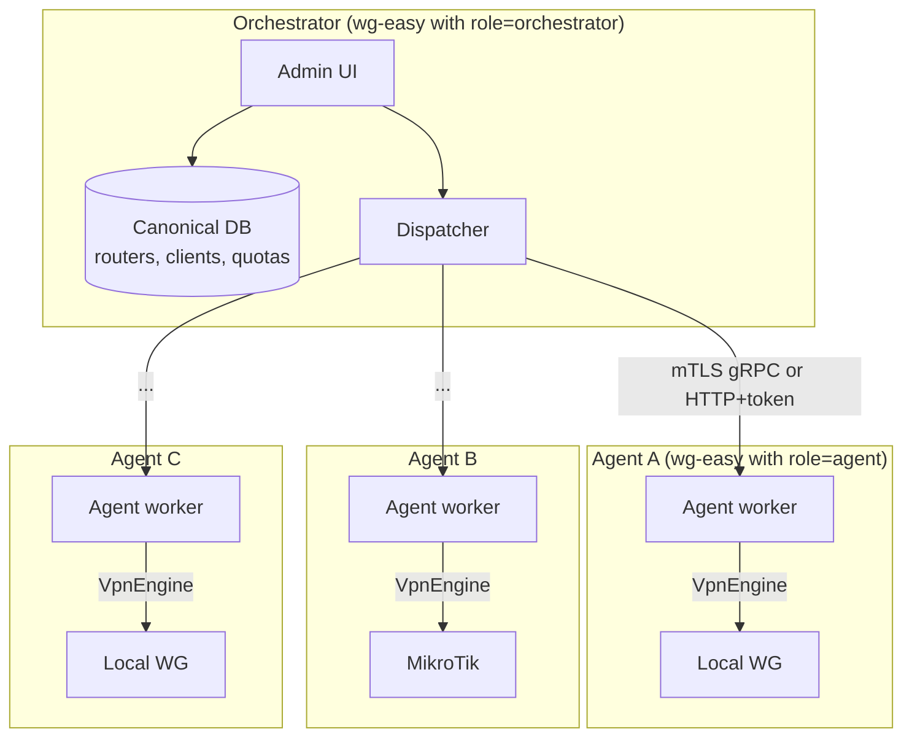

The **orchestrator** is the only node with the canonical DB and the admin UI. **Agents** are wg-easy installations running in agent mode: no UI, no DB beyond a small local cache, just a worker that takes commands from the orchestrator and executes them via the same `VpnEngine` drivers.

A "router" in the data model can be:
- `transport=local-shell` on the orchestrator (= "local interface, no agent")
- `transport=ssh` or `transport=routeros-api` (= "remote device, no agent")
- `transport=agent` (= "remote wg-easy agent, which then talks to its local data plane via local-shell")

Why agents? Because some deployments can't expose RouterOS API or SSH externally; the agent makes an outbound mTLS connection to the orchestrator instead.

PRD: [[prds/40-multi-server/01-multi-router-federation]].

---

## 9. Multi-path routing

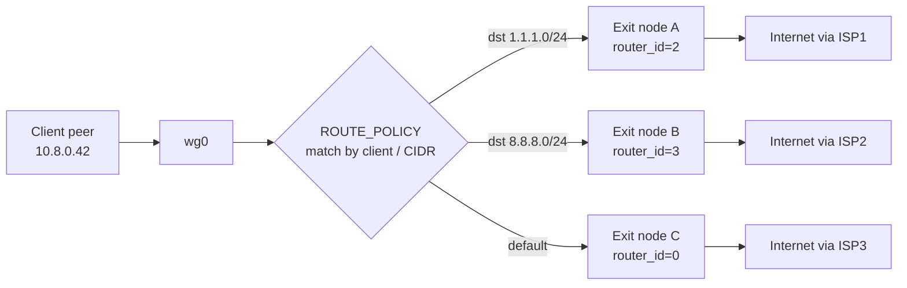

A `ROUTE_POLICY` row says: "for traffic from `client_id` (or any client matching `match_cidr`) destined for `match_dst_cidr`, send it via `exit_node_id`." The control plane translates these into `ip rule` + `ip route` on Linux exits and `/ip/route/rule` on MikroTik exits.

This is the most complex feature in the roadmap and is gated behind multi-router federation (you can't have multiple exits without multiple routers). Hence P3.

PRD: [[prds/40-multi-server/03-multi-path-routing]].

---

## 10. Phasing dependency graph

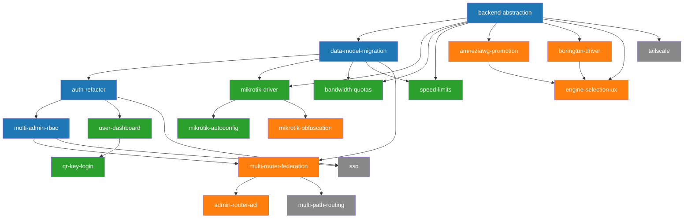

Read this as: every arrow is "must ship before". The four P0 PRDs form a chain (no parallelism). P1 fans out from P0. P2 mostly depends on P0 + at least one P1. P3 is the long tail.

If you want to know whether a PRD is unblocked, check that every node it points back to has `status: shipped`.
