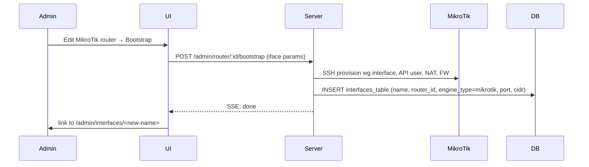

# PRD-30-05 — Multi-interface, per-client router selection

> Replaces the implicit "one active interface" assumption that survives in the
> codebase even though `interfaces_table` is keyed by `name` and supports many
> rows. Today, `Database.interfaces.get()` (no args) returns the singleton, the
> client form has no interface picker, and the only way to "switch" routers is
> to mutate that singleton. With this PRD a wg-easy install can host N
> interfaces simultaneously — typically one local kernel WG plus one or more
> MikroTik / AmneziaWG / BoringTun targets — and each client is created against
> a chosen interface.

## Why

The strategic bet on router-agnostic, multi-tenant VPN control plane (see
[[architecture]]) requires a control plane that can manage *many* targets
concurrently, not pick one as primary. Single-interface forces every operator
into "rebind the singleton every time" — fine for a homelab, fatal for an MSP
serving several customer sites from one wg-easy.

The data model already permits multi-interface. The blocker is API + UI surface
that assumes singleton, plus a missing FK from clients to a chosen interface
(today `clients_table.interfaceId` is text but unconstrained, and the UI never
sets it explicitly).

## User stories

- As an **admin**, I see all interfaces in `Admin → Interfaces` (list view), can
  create/delete them, and edit their per-engine settings independently.
- As an **admin**, when I create a client I pick which interface (= router) it
  lives on. The list defaults to the most recently used interface.
- As an **admin**, I can move an existing client from one interface to another
  in one action (re-key + re-sync both sides).
- As an **operator** running the Bootstrap Wizard for a MikroTik router, the
  wizard *adds* a new interface bound to that router instead of mutating the
  singleton.

## Out of scope

- Per-client routing across multiple interfaces simultaneously (covered by
  [[prds/40-multi-server/03-multi-path-routing|PRD-40-03]]).
- Federation / remote agents ([[prds/40-multi-server/01-multi-router-federation|PRD-40-01]]).
- Per-user (end-user, role=CLIENT) selection of which interface their config
  binds to — admins make that choice for now.

## Data model

```sql
-- 0009_multi_interface.sql

-- Drop the artificial unique on port: distinct interfaces can reuse a port if
-- they live on different routers. Keep uniqueness on (name) which is already
-- the PK, and add (port, router_id) uniqueness instead.
DROP INDEX IF EXISTS interfaces_table_port_unique;
CREATE UNIQUE INDEX interfaces_table_port_router_unique
  ON interfaces_table(port, router_id);

-- interfaceId on clients_table already exists as text-PK referencing
-- interfaces_table.name. Add an FK with ON DELETE RESTRICT and a NOT NULL
-- constraint so orphaned clients are impossible.
-- (Implementation: rebuild clients_table per drizzle-orm conventions.)
```

No schema additions to `interfaces_table` itself — existing columns
(`name`, `engine_type`, `router_id`, etc.) already model what we need.

## API

### `GET /api/admin/interface`

**Before:** returns the singleton interface object.
**After:** returns `InterfaceType[]`. Components that previously expected one
must be updated; this is a breaking change at the route level. To soften
migration we keep `GET /api/admin/interface/active` returning the most
recently-used interface (used by status widgets that don't yet support multi).

### `POST /api/admin/interface`

**Before:** updates the singleton.
**After:** creates a new interface. Body matches `InterfaceCreateSchema` plus
required `name`, `routerId`, `port`. Returns the created row.

### `PATCH /api/admin/interface/:name`

New. Updates a specific interface. Same body shape as today's POST update
(without `name` mutation; rename via separate flow if ever needed).

### `DELETE /api/admin/interface/:name`

New. Deletes the interface. Refuses if any client still references it (FK
RESTRICT). Force-delete with `?cascade=clients` to also delete dependent
clients (audited).

### `POST /api/admin/router/:id/activate` — **deprecated**

After this PRD, "activate" is no longer meaningful — there's no singleton to
flip. The endpoint stays for one release as a no-op that returns 410 Gone with
a pointer to the new endpoints.

### Client creation

`POST /api/admin/clients` body gains `interfaceName: string` (required).
The server validates the interface exists and is enabled; engine selection
follows the chosen interface's `engineType`/`routerId`.

## UI

### `Admin → Interfaces` (new)

List view with columns: name, engine, router (resolved name), port, peer count,
status. Buttons: Create, Edit, Delete. The per-interface edit page is the
existing `admin/interface.vue` content moved under `/admin/interfaces/[name]`.

The MikroTik **Bootstrap Wizard** at `/admin/routers/:id/bootstrap` no longer
mutates a singleton on completion — it creates a new interface row bound to
that router with the wizard inputs (`ifaceName`, `listenPort`, `ipv4Cidr`,
`ipv6Cidr`).

### Client creation form

New required field "Interface", a dropdown of enabled interfaces grouped by
router. Default = `localStorage.lastInterfaceName` ?? first enabled interface.

### Move client between interfaces

On the client edit screen, an "Interface" field becomes editable. Saving with a
changed value:

1. Calls `engine.removeClient` on the old interface.
2. Generates a new IP from the new interface's CIDR (if the old IP doesn't fit).
3. Calls `engine.syncClient` on the new interface.
4. Updates the row.

Failures roll back so a client never has a partially-applied move.

## Sequence: bootstrap wizard after this PRD



## Acceptance tests

1. **List** — create two MikroTik routers, run bootstrap on both, confirm
   `/admin/interfaces` shows three rows (`wg0` self + two MikroTik) with the
   right router associations.
2. **Per-client target** — create one client on each interface, verify each
   appears on the correct router (via `engine.sampleUsage` for MikroTik, via
   `wg show` for self).
3. **Move** — move a client from `wg0` (self) to a MikroTik interface; the peer
   disappears from `wg show` and appears on the MikroTik with a fresh IP from
   that interface's CIDR. Reverse move works too.
4. **FK guard** — deleting an interface with active clients returns 409; with
   `?cascade=clients` it succeeds and audit log records the cascade.
5. **Port collision** — two interfaces on the *same* router with the same port
   are rejected; same port on *different* routers is allowed.
6. **Activate deprecated** — `POST /admin/router/:id/activate` returns 410 with
   a JSON pointer to `/admin/interfaces`.
7. **Bootstrap idempotency** — running bootstrap twice with the same iface name
   doesn't create duplicates; it updates the existing row in place.

## Migration plan

P0 of this PRD — before the multi-interface APIs are exposed — backfill the
existing singleton row's `routerId` from any "active" router selection so every
existing wg-easy install has a clean starting point. The `0009_multi_interface`
migration runs the FK addition; existing single-interface installs continue to
work with N=1.

## Risks & follow-ups

- **`Database.interfaces.get()` callers** — there are several. They must each
  decide whether they want "the active one" (legacy widgets) or "all of them"
  (new admin views). An audit pass before merge is required; the type signature
  change will surface most.
- **Engine bring-up cost** — N interfaces means N engine instances at boot.
  For local kernel WG this is fine; for BoringTun/AmneziaWG with userspace
  daemons it's worth a smoke test on a 5-interface install.
- **End-user dashboard** — when a client is on a non-self interface, the
  dashboard's "your config" still works (engine generates the same client
  config artifact), but bandwidth/usage widgets may need per-interface fanout.
